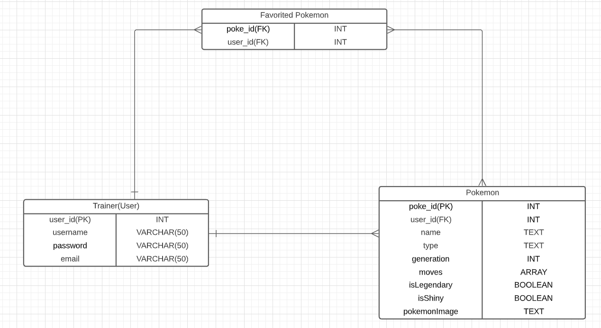

# pokemon-generator

### Set Up

- Create a new database called pokemon in postgres/pgadmin.
- Run the app to connect to it

### Pokémon Generator with Java Spring Boot

Pokémon Generator is a project created with Java Spring Boot that utilizes API endpoints to let users create their own pokémon and modify them.

This app is for users that want to create their own storage of pokémon for a place to go to when they want check out a pokémon's information.

Users will be able to look at other pokémon owned by different users to check out a variety of pokémon that exists in the pokémon world.

The app has a registration and login feature that uses JSON web tokens for authentication and authorization, so this allows users to create their own account and sign in it. Furthermore, if a user no longer wants to use the app, then they are able to delete their account. They can also change their password too.

## How I worked on this project

### Entity Relationship Diagram (ERD)

- User/Trainer table has a one to many relationship with Pokemon table since a trainer can have many pokémon, but a pokémon can only have one owner.
- Same relationship concept between User and Pokemon table applies to a user and their favorite pokémon.
- Many-to-many relationship from Pokemon to Favorited Pokemon

### User Stories

1. Users(trainers) will be able to create their own pokémon.

| Acceptance Criteria                                                                                                  |
|----------------------------------------------------------------------------------------------------------------------|
| Given - The user want to add a pokémon to the pokemon database                                                       |
| When -  The user needs to add the information of the pokémon they want to create                                     |
| Then - After the user is finished inputting the information of the pokémon, their pokémon gets added to the database |

2. As a user, I can view only the pokémon.

| Acceptance Criteria                                                                        |
|--------------------------------------------------------------------------------------------|
| Given - The user wants to look what pokemon they have in their pokemon database            |
| When -  The user sends a GET request to see all the pokemon in their database              |
| Then - Every pokemon owned by the user and their information from the database is returned |

3. As a user, I can pick my favorite pokémon and view them.

| Acceptance Criteria                                                                        |
|--------------------------------------------------------------------------------------------|
| Given - The user wants to add a pokemon into their favorites                               |
| When -  The user sends a PUT request to add their pokemon into their favorite pokemon list |
| Then - the updated favorite pokemon list is returned                                       |

4. As a user, I can view all of my pokémon databases (Pokemon and Favorite Pokemon)

| Acceptance Criteria                                                                                     |
|---------------------------------------------------------------------------------------------------------|
| Given - The user wants to check both their favorited pokemon and all of their pokemon                   |
| When -  The user sends a GET request to see both the Favorite Pokemon table and Pokemon table           |
| Then - Every pokemon including favorited pokemon and their information from their databases is returned |

5. As a user, I can teach(update) new moves to any of my pokémon.

| Acceptance Criteria                                              |
|------------------------------------------------------------------|
| Given - The user wants teach their pokemon new moves             |
| When -  The user sends a PUT request to update a pokemon's moves |
| Then - The pokemon's moves are updated and shown in the tables   |

6. As a user, I can register.

| Acceptance Criteria                                                 |
|---------------------------------------------------------------------|
| Given - The user wants to create an account                         |
| When -  The user inputs their username, password, and email address |
| Then - An account with the information that user gave is created    |

7. As a user, I can log in.

| Acceptance Criteria                                                                                |
|----------------------------------------------------------------------------------------------------|
| Given - The user wants to log in to their account                                                  |
| When -  The user inputs the email address and password of their registered account                 |
| Then - When the account information is correct, the user is logged in and has access to the tables |

8. As a user, I can release(delete) a pokémon.

| Acceptance Criteria                                                            |
|--------------------------------------------------------------------------------|
| Given - The user wants to release one of their pokemon                         |
| When -  The user sends a DELETE request to one of their pokemon in their table |
| Then - The selected pokemon and their information is deleted                   |

9. As a user, I can view a single pokémon in my pokemon database

| Acceptance Criteria                                                             |
|---------------------------------------------------------------------------------|
| Given - The user wants to check the information of a specific pokemon           |
| When -  The user sends a GET request with a pokemon's id                        |
| Then - The pokemon that has the corresponding id has their information returned |

10. As a user, I can update any of my pokémon's information

| Acceptance Criteria                                                              |
|----------------------------------------------------------------------------------|
| Given - The user wants to change one or more of the pokemon's fields             |
| When - When the user sends a PUT request to update                               |
| Then - The new information of the pokemon is returned and stored in the database |

11. As a user, I can release(delete) all of my pokémon

| Acceptance Criteria                                                                        |
|--------------------------------------------------------------------------------------------|
| Given - The user wants to get rid of all his pokemon                                       |
| When - When the user sends a DELETE request to delete all of the pokemon in their database |
| Then - All pokemon in both pokemon list and favorite pokemon list are cleared              |

12. As a user, I can change my password

| Acceptance Criteria                                                                    |
|----------------------------------------------------------------------------------------|
| Given - The user wants to use a different password to login                            |
| When - When the user sends a PUT request to update his current password with a new one |
| Then - The new password will be encrypted and replace the current password             |

13. As a user, I can delete my own account

| Acceptance Criteria                                                                    |
|----------------------------------------------------------------------------------------|
| Given - The user wants delete their account because they do not want to use it anymore |
| When - When the user sends a DELETE request for account deletion                       |
| Then - The user account will be erased from the database and completely deleted        |

### System Tools

|            Tools             |
|:----------------------------:|
|         Spring Boot          |
|         Apache Maven         |
|           Postman            |
|         LucidCharts          |
| IntelliJ IDEA/Java 11 and 17 |
|       Json Web Tokens        |
|           Postgres           |
|            Google            |

## Endpoints

| ENDPOINT                                | FUNCTIONALITY                                       |
|-----------------------------------------|:----------------------------------------------------|
| POST _/auth/users/register_             | Register a User                                     |
| POST _/auth/users/login_                | Log in as User                                      |
| GET _/auth/users/list_                  | GET All Users                                       |
| GET _/auth/users/{username}_            | GET A User                                          |
| PUT _/auth/users/changepassword_        | UPDATE the password                                 |
| DELETE _/auth/users/delete_             | DELETE user account                                 |
| POST _/api/pokemon/_                    | CREATE A Pokemon                                    |
| GET _/api/pokemon/_                     | GET All Pokemon                                     |
| GET _/api/pokemon/{pokemonId}_          | GET A Pokemon                                       |
| PUT _/api/pokemon/{pokemonId}_          | UPDATE A Pokemon                                    |
| PUT _/api/pokemon/{pokemonId}/moves_    | UPDATE A Pokemon's moves                            |
| PUT _/api/pokemon/{pokemonId}/favorite_ | Add pokemon to current user's favorite pokemon list |
| DELETE _/api/pokemon/{pokemonId}_       | DELETE A Pokemon                                    |
| DELETE _/api/pokemon/_                  | DELETE ALL Pokemon                                  |

## If I had more time, I would change this

### Original Project Entity Relationship Diagram (ERD)

- Creating a random Pokémon generator that automatically creates a Pokémon and adds it to the Generated Pokémon table.
- The pokémon would be automatically stored into one of the tables(Pokemon, Legendary, Shiny) based on its rarity.
- If the user updated the pokémon and set its isFavorite boolean value to true, then it would be stored in the Favorited Pokemon table.

## Project Challenges
1. Implementing the feature where a user can add a pokémon to their favorite pokemon list
- I had a difficult time dealing with the exceptions for this feature because I had some trouble handling the exception when the pokémon does not belong to the user. I solved this problem by comparing usernames because each pokémon is owned by a user, so the owner's username and the username of the user trying to add the pokémon into their favorites can be compared to make sure it s the correct user. I also had to find a solution that prevents duplicate pokémon from being added to the favorite pokémon list. I made a solution for this by grabbing the list of the user's favorite pokémon and comparing each pokémon in it with the pokémon that is being added to check if the same pokémon is already in there.
2. Allowing the user to change their password
- I could not figure out how to update an encrypted password at first because I thought I needed to decode the encrypted password and then change it. After I thought about it some more, I end up with a solution of getting the input of the new password and set its encrypted version as the new password.  
3. Deleting the user account
- I tried implementing a method that could delete the list and the user account all together, but I was not able to do it. Instead, I just created an exception handler that throws when the user does not have an empty pokemon list. Therefore, when the user sees that their list is not empty, then they can use my deleteAllPokemon request to clear their lists and delete the account.